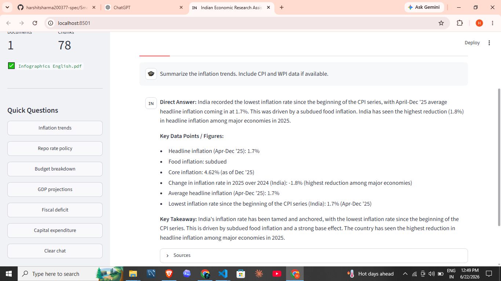
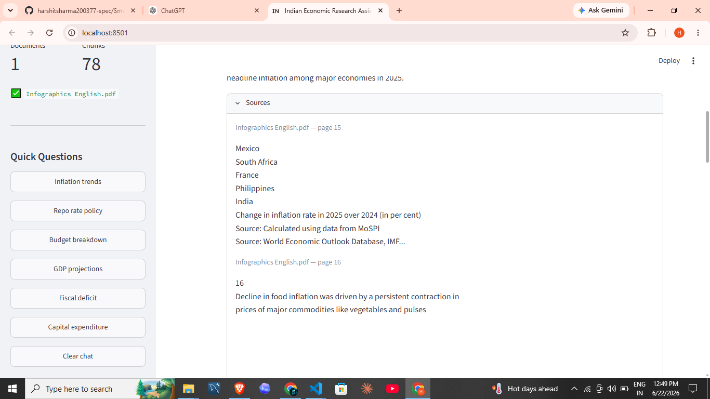
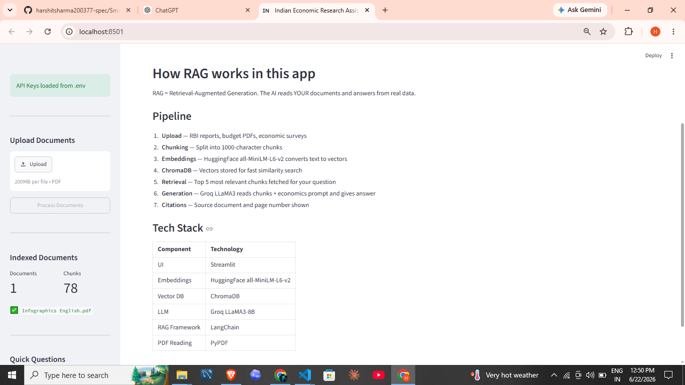

# 🇮🇳 Indian Economic Research Assistant

A RAG-powered chatbot for M.A. Economics students to query RBI reports, Union Budgets, and Economic Surveys — built with Streamlit, LangChain, ChromaDB, and Groq LLaMA3.

[](https://your-app-name.streamlit.app)

---
## LIVE DEMO : https://rag-india-economics-intelligence-vzvhagbc2sitmmdtkcwpvr.streamlit.app/

---
## Screenshots

### Home — Upload & Process Documents


### Research Chat — AI-Powered Answers


### Source Citations


### How It Works


---

## Features

- 📄 Upload multiple RBI/Budget/Economic Survey PDFs
- 🔍 Semantic search with HuggingFace embeddings (all-MiniLM-L6-v2)
- ⚡ Fast inference via Groq LLaMA3-8B
- 📚 ChromaDB vector store for document retrieval
- 📌 Source citations with page numbers
- ❓ Quick-question shortcuts for common research queries

## Tech Stack

| Component     | Technology                    |
|---------------|-------------------------------|
| UI            | Streamlit                     |
| Embeddings    | HuggingFace all-MiniLM-L6-v2  |
| Vector DB     | ChromaDB                      |
| LLM           | Groq LLaMA3-8B                |
| RAG Framework | LangChain                     |
| PDF Reading   | PyPDF                         |

---

## Local Setup

### 1. Clone the repo
```bash
git clone https://github.com/YOUR_USERNAME/indian-econ-assistant.git
cd indian-econ-assistant
```

### 2. Create a virtual environment
```bash
python -m venv venv
venv\Scripts\activate        # Windows
# source venv/bin/activate   # Mac/Linux
```

### 3. Install dependencies
```bash
pip install -r requirements.txt
```

### 4. Add your API keys
Create a `.env` file in the project root:
```
GROQ_API_KEY=your_groq_api_key_here
HUGGINGFACEHUB_API_TOKEN=your_huggingface_token_here
```

Get your keys:
- Groq: https://console.groq.com
- HuggingFace: https://huggingface.co/settings/tokens

### 5. Run the app
```bash
streamlit run app.py
```

---

## Deploy to Streamlit Cloud

1. Push this repo to GitHub (make sure `.env` is in `.gitignore` ✅)
2. Go to [share.streamlit.io](https://share.streamlit.io) and click **New app**
3. Select your repo and set `app.py` as the main file
4. Under **Advanced settings → Secrets**, add:
```toml
GROQ_API_KEY = "your_groq_api_key_here"
HUGGINGFACEHUB_API_TOKEN = "your_huggingface_token_here"
```
5. Click **Deploy** 🚀

---

## Usage

1. Upload one or more PDFs (RBI reports, Budget documents, Economic Survey)
2. Click **Process Documents**
3. Use Quick Questions or type your own in the chat
4. Expand **Sources** under any answer to see citations

---

## Project Structure

```
indian-econ-assistant/
├── app.py                  # Main Streamlit app
├── requirements.txt        # Python dependencies
├── .gitignore
├── .streamlit/
│   └── secrets.toml        # Local secrets template (not committed)
└── screenshots/
    ├── screenshot1_home.png
    ├── screenshot2_chat.png
    ├── screenshot3_sources.png
    └── screenshot4_how_it_works.png
```

---

## ⚠️ Security Note

Never commit your `.env` file or real API keys to GitHub. This repo's `.gitignore` already excludes `.env`. On Streamlit Cloud, use the Secrets manager.
